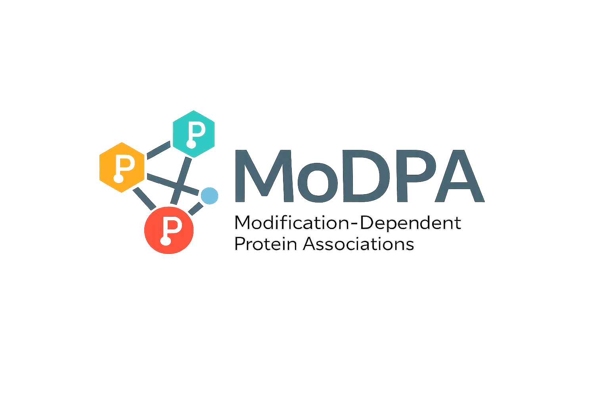

# MoDPA: Modification-Dependent Protein Associations

[](https://github.com/EnriMassi/MoDPAv1.0/actions/workflows/tests.yml)

Post-translational modifications (PTMs) are key regulators of protein function and cellular
processes. The overall principles of PTM co-regulation and crosstalk, however, remain to be fully
understood.

PTM calls across public experiments are extremely sparse and heterogeneous. To handle this, MoDPA
uses a variational autoencoder (VAE) to embed per-site detection profiles into a low-dimensional
latent space that preserves covariation while denoising missing data. A PTM association network is
then built by correlating the latent representations of PTM events across experiments.

## Workflow

Each numbered folder is one stage of the analysis and has its own README with the commands, the
inputs and the outputs.

| Stage | Folder | What it does | Main output |
| --- | --- | --- | --- |
| 1 | [`1-quant-pipeline-latest`](1-quant-pipeline-latest) | map peptidoforms to proteins, compute relative PTM counts, build the PTM-by-MS-run matrix | `*-PTMs-thresh5r5c-std0.05.pkl.gz` |
| 2 | [`2-VAE-code`](2-VAE-code) | train and select a VAE, encode the matrix, score every PTM pair | `*-signed-distances.csv.gz` |
| 3 | [`3-pulse-silac-validation`](3-pulse-silac-validation) | validate the network against pulsed SILAC ground truth and two null networks | validation plot |
| 4 | [`4-PTM-pairs-annotation`](4-PTM-pairs-annotation) | annotate PTM pairs against UniProt and the literature | triage tables, shortlist |
| 5 | [`5-pathway-ORA`](5-pathway-ORA) | Reactome over-representation analysis per network cluster | enrichment tables, heatmaps |

`2-VAE-code/Sensitivity-analysis` quantifies how much the network depends on the latent
dimensionality, and has its own README.

The association list produced by stage 2 has one row per PTM pair, with the columns `nodeA`,
`nodeB`, `Score`, `pval`, `distance`, `PCC` and `qvalue`. `Score` is the signed distance
correlation (SDCor) and `distance` is its magnitude. Nodes are PTM events identified as
`UniProtAccession|Position|Residue|UnimodID`, for example `P04637|15|S|21`.

## Building and clustering the network

`2-VAE-code/build_modpa_network.py` turns an association list into the two files that stages 3, 4
and 5 read, `<prefix>-filtered-distances.csv` and `<prefix>-Leiden-clusters.csv`:

```bash
python 2-VAE-code/build_modpa_network.py <model folder>/<datetime>-<run name>-signed-distances.csv.gz
```

It is a driver over `modpa_network_utilities.py`, in the repository root, which holds the functions
that turn an association list into the analysed network. Stages 4 and 5 and the sensitivity
analysis all use the same module.

| Function | Purpose |
| --- | --- |
| `discover_runs` | locate the signed-distance file of every model run under a directory |
| `parse_network` | lazily scan, filter and annotate an association list |
| `build_graph` | build a NetworkX graph, collapsing duplicate and reversed edges |
| `run_leiden`, `run_leiden_unweighted` | Leiden clustering, weighted by the absolute SDCor or unweighted, returning node to cluster membership |
| `build_clusters_df`, `add_protein_annotations` | assemble the annotated cluster table |
| `jaccard`, `count_edges`, `count_nodes`, `edge_set`, `node_set` | set comparisons between runs |

Nodes carry the Unimod accession of their modification, not its name. Passing `--ptm-names
1-quant-pipeline-latest/PTMs-of-interest-submission.csv`, the PTM list the published matrix was
built with, adds a `PTM_name` column to the cluster table, joining on the accession and the residue
together. A different PTM set needs its own list.

An edge is kept when `Score >= min_score` and `qvalue < 0.05`. The score test uses the signed
score, so the analysis covers positively correlated PTM pairs and discards strongly anti-correlated
ones. The threshold used throughout is `Score >= 0.6`, which leaves 6,491 nodes and 14,591 edges on
the reference network.

`parse_network` also annotates each edge with `same_protein`, `position_gap`, `same_site`,
`same_mod`, `shared_peptide` and `potential_artefact`. An edge is flagged as a potential artefact
when both PTMs carry the same modification and sit within `adjacency_window` (5 by default)
residues of each other on the same protein, which is the configuration in which a shared peptide
can produce a correlation that is not biological. These edges are annotated, not removed.

> **`shared_peptide` and `potential_artefact` are rough approximations and should be treated with
> caution.** Both rest on a fixed proximity rule, `same_protein` and `position_gap <= 5`, which is
> not a statement about what was actually measured together. Whether two sites can fall on one
> tryptic peptide depends on where the cleavage sites are, not on how far apart the sites are, so
> the rule both flags pairs that cannot share a peptide and misses pairs that can.
> `4-PTM-pairs-annotation/scripts/s10_tryptic.py` computes the proper test, digesting the protein
> sequence with trypsin at up to two missed cleavages, and quantifies how far the proximity rule
> departs from it. Do not read either column as evidence of co-quantification. Both columns are
> scheduled for removal.

Clustering uses Leiden on the RBConfiguration objective with the absolute SDCor as the edge weight,
`resolution_parameter = 2`, `n_iterations = 2` and seed 42. On the reference network this gives 556
clusters, of which 43 hold at least 20 distinct proteins and were therefore tested for pathway
over-representation in stage 5. `run_leiden_unweighted`, exposed by the driver as `--unweighted`,
gives every retained edge the same weight, so the partition depends on the topology of the filtered
network alone. Every published result uses the weighted partition.

## Installation

The pipeline was run on Python 3.10.19. `PTMmap-0.1.3-py3-none-any.whl` is a local dependency and
is installed by both environment files, so create the environment from the repository root.

CPU environment:

```bash
conda env create -f env.yml
conda activate MoDPA-env
```

GPU environment, for training on WSL with TensorFlow 2.21 and the bundled CUDA and cuDNN:

```bash
bash setup-wsl-gpu.sh setup
bash setup-wsl-gpu.sh check
```

`setup` creates the environment from `env-wsl-gpu.yml` and installs PTMmap; `check` verifies that
TensorFlow sees the GPU.

`env.yml` covers every stage except VAE training, which needs the GPU environment. Everything
downstream of training, including the sensitivity analysis, runs in the CPU environment.

Estimated run time of the full pipeline on the pulsed SILAC dataset is one to two hours, and about
three hours on a low-end laptop. Training the VAE grid and scoring all PTM pairs on the full
dataset is considerably longer and needs a GPU and a large amount of RAM.

## Tests

The pure functions that carry a reported number are covered by a pytest suite in `tests/`.

```bash
pip install -r requirements-test.txt
python -m pytest
```

`requirements-test.txt` is a small subset of `env.yml`; it omits TensorFlow and the rest of the
training stack, which the tests do not need. Configuration is in `pyproject.toml`, which declares no
`[project]` table because this repository is a collection of analysis scripts rather than an
installable package. `tests/conftest.py` puts every script directory on `sys.path` and provides
`load_functions()`, which extracts named functions from the numbered stage scripts of stage 4
without executing their module-level queries.

| File | Covers |
| --- | --- |
| `tests/test_tryptic.py` | `cuts_of` and `shares` in `4-PTM-pairs-annotation/scripts/s10_tryptic.py`, the tryptic co-peptide flags |
| `tests/test_pair_packing.py` | `pack`, `packp`, `isin_sorted`, `dec` and `tier_of` in `4-PTM-pairs-annotation/scripts/s15_background.py` |
| `tests/test_bh_adjust.py` | `bh_adjust` in `5-pathway-ORA/reactome_network_background_ora.py`, against `scipy.stats.false_discovery_control` |
| `tests/test_validate_edges.py` | the edge labelling rules in `3-pulse-silac-validation/validate_edges.py` |
| `tests/test_topology_compare.py` | `2-VAE-code/Sensitivity-analysis/topology_compare.py`, converted from its `_self_test()` block |

`tests/test_topology_compare.py` skips as a whole when igraph, leidenalg or scikit-learn are absent,
so a partial environment reports a skip rather than an error.

`.github/workflows/tests.yml` runs the suite on every push to `main` and on every pull request,
against Python 3.10 and 3.11. A second job byte-compiles every tracked `.py` file with
`py_compile`, which catches a syntax error in the scripts that have no tests without needing their
dependencies or their input files.

## Reproducing the published results

To reproduce the results you need a peptidoform identifications file, a peptidoform counts file and
a FASTA file to map peptidoforms to proteins. Start from the README of
[`1-quant-pipeline-latest`](1-quant-pipeline-latest) and work through the stages in order.

## Data availability

The repository is distributed in two forms.

**GitHub** holds the code, the FASTA files, the PTM lists, and the small result tables and figures
of the reported runs. The data archives are excluded by `.gitignore`, together with every other
compressed file, so nothing large is tracked in git.

**Zenodo** holds the same repository with the data archives included, so the pipeline can be rerun
without regenerating its inputs. The archives are placed in the folder of the stage that uses them:

| Archive | Size | Contents |
| --- | --- | --- |
| `1-quant-pipeline-latest/MoDPA_unprocessed.tar.gz` | 2.0 GB | unprocessed input of stage 1 |
| `2-VAE-code/MoDPA_models.tar.gz` | 9.9 GB | trained models: `config.json`, `vae.weights.h5` and `provenance.json` per run |
| `4-PTM-pairs-annotation/input_and_expected_ouput.tar.gz` | 2.9 GB | inputs and expected outputs of stage 4 |

> **The models archive holds weights only.** The latent spaces (`Latent-space.pkl.gz`) and the
> association lists (`*-signed-distances.csv.gz`) were removed to bring the archive within the
> Zenodo size limit, so they have to be regenerated from the weights before stages 3, 4 and 5 and
> the sensitivity analysis can run. Per model run, in order:
>
> ```bash
> python 2-VAE-code/VAE_encode.py <model folder> <MoDPA matrix .pkl.gz>
> python 2-VAE-code/calculate_sdcorr.py <model folder>
> ```
>
> Encoding is quick. Scoring all PTM pairs is not: it is quadratic in the number of PTM events and
> writes an association list of 1.2 GB to 1.3 GB per run. Regenerate only the runs needed. Stages 3,
> 4 and 5 need the reference run alone; the sensitivity analysis needs all 14.

The v0113 peptidoform dataset is available on Zenodo as a separate record:
https://zenodo.org/records/18310674

Swiss-Prot release 2026_03, used by stage 4, is a public archived UniProt release and is downloaded
by the notebook of that stage if it is absent.

## License

Licensed under the Apache License, Version 2.0. See [LICENSE](LICENSE).
